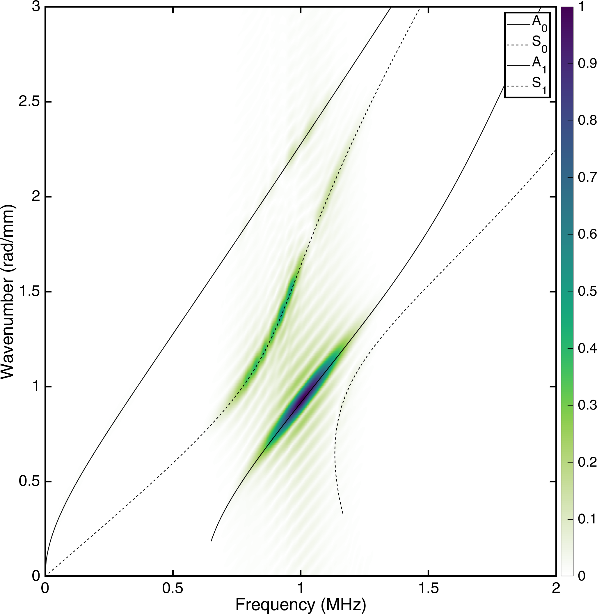

# 2D-FFT for ultrasonic guided wave mode identification

A guide to this code can be found here: https://lawrenceyule.com/2022/09/10/2d-fft-analysis-in-matlab/

Each .csv file refers to a simulation targetting a different wave mode ($S_0$, $A_1$, and $S_1$) at different aluminium plate thicknesses (1, 2.5, and 4 mm respectively). Adjust the `multiplier` value accordingly. 

